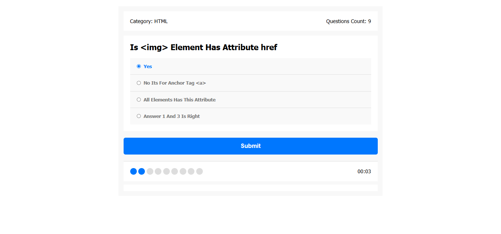

# Quiz App

## Welcome! 👋

## Table of contents

- [Overview](#overview)
  - [Links](#links)
- [My process](#my-process)
  - [Built with](#built-with)
  - [Useful resources](#useful-resources)
- [Author](#author)
- [Acknowledgments](#acknowledgments)

## Overview

### Links

- Repository URL: [Repo URL](https://github.com/ilham-bouk/Quiz_App)
- Live Site URL: [Live Site](https://ilham-bouk.github.io/Quiz_App/)

## My process

### Built with

- Semantic HTML5 markup
- CSS custom properties
- JavaScript 
- Disktop-first workflow

### Useful resources

- [MDN Web Docs](https://developer.mozilla.org/en-US/docs/Web/CSS/)

## Author

- Frontend Mentor - [@ilham-bouk](https://www.frontendmentor.io/profile/ilham-bouk)
- LinkedIn - [Ilham Bouktir](https://www.linkedin.com/in/ilham-bouktir-0b266b31b)

## Acknowledgments

If you have any questions or need further assistance, feel free to open an issue on GitHub or contact me directly. Your contributions and feedback are highly appreciated!

**Happy coding!** ☺️🚀
